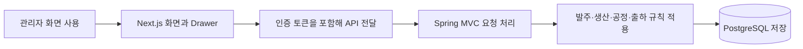

# 프로젝트 문서 포털

## 문서 포털

| 분류 | 문서 | 분류 | 문서 |
| --- | --- | --- | --- |
| 루트 README | [README](../readme.md) | 설계 문서 | [Engineering](ENGINEERING.md) |
| 데이터베이스 | [Database Schema](database-schema.md) |  |  |
| 프론트엔드 | [Frontend Docs](../frontend/docs/README.md) | 백엔드 | [Backend Docs](../orderSystem/docs/README.md) |

## 개요

이 포털은 발주 접수부터 생산지시, 제품 QR 생성, 공정 변경, 출하와 이력 조회까지의 실제 구현 문서를 연결한다.

## 시스템 구성

## 현재 구현 범위

- PostgreSQL과 Spring Data JPA를 사용한다.
- JWT와 역할 기반 접근 제어를 사용한다.
- Redis, Spring Batch, Scheduler, WebSocket 구현은 존재하지 않는다.
- Dockerfile과 Docker Compose 구성은 존재하지 않는다.
- `db/manual` SQL은 Flyway가 자동 실행하지 않으며 기존 DB에 수동 적용한다.
