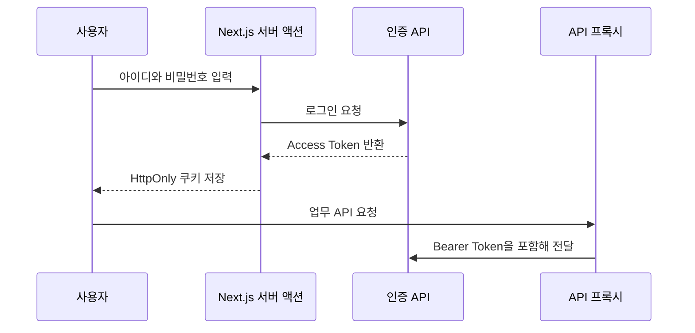

# 시스템 설계

## 문서 포털

| 분류 | 문서 | 분류 | 문서 |
| --- | --- | --- | --- |
| 루트 README | [README](../readme.md) | 문서 포털 | [Documentation](DOCUMENTATION.md) |
| 데이터베이스 | [Database Schema](database-schema.md) |  |  |
| 프론트엔드 | [Frontend Docs](../frontend/docs/README.md) | 백엔드 | [Backend Docs](../orderSystem/docs/README.md) |

## 목차

> [개요](#개요) · [책임 분리](#책임-분리) · [인증 경계](#인증-경계) · [업무 상태 흐름](#업무-상태-흐름) · [데이터 일관성](#데이터-일관성) · [성능 설계](#성능-설계) · [현재 제외된 기술](#현재-제외된-기술)

## 개요

시스템은 `frontend`와 `orderSystem` 두 애플리케이션으로 구성된다. 프론트엔드는 화면, 목록 상호작용, Drawer 편집과 JWT 쿠키 전달을 담당한다. 백엔드는 발주·생산·제품·공정·출하 규칙과 PostgreSQL 영속화를 담당한다.

## 책임 분리

| 계층 | 책임 |
| --- | --- |
| App Router | URL 진입점과 레이아웃 연결 |
| `src/feature` | 기능 화면, 로컬 상태, API 결과 변환 |
| API 프록시 | HttpOnly 쿠키의 JWT를 백엔드 헤더로 전달 |
| Controller | HTTP 요청·응답과 검증 진입점 |
| Service | 상태 전환, QR 생성, 삭제 순서, 트랜잭션 |
| Repository | fetch join 조회, 집계, 일괄 삭제 |
| Entity | 실제 PostgreSQL 테이블과 JPA 관계 |

## 인증 경계

로그인과 회원가입, `GET /order/getDashBoard`만 공개된다. `/order/**`, `/order-purchase-history/**`, `/users/**`는 `ADMIN` 역할이 필요하다.

## 업무 상태 흐름

실제 Enum은 `PURCHASESUBMIT`, `INSTRUCTION`, `ASSEMBLY`, `TEST`, `FINAL_INSPECTION`, `PACKAGING`, `SHIPPED`, `CANCEL`이다. 제품별 상태 변경을 허용하고 발주 상태는 같은 발주의 제품 중 가장 느린 공정으로 동기화한다.

## 데이터 일관성

- 발주 생성 시 비어 있는 생산지시를 함께 만든다.
- 생산수량은 발주수량을 넘을 수 없고 이미 생성한 QR 개수보다 줄일 수 없다.
- 제품 QR은 `LOT-순번`으로 생성하며 기존 QR은 LOT 변경 시 교체하지 않는다.
- 공정 변경과 출하는 공정 이력을 같은 트랜잭션에 저장한다.
- 발주·생산지시 삭제는 이력, 제품, 생산지시, 발주 순으로 명시적으로 삭제한다.

## 성능 설계

- JPA `batch_size=50`, insert/update 정렬과 batch versioned data를 설정한다.
- 제품·생산지시 목록은 fetch join으로 연관 데이터를 한 번에 조회한다.
- 공정 이력 ID sequence의 `allocationSize=50`을 PostgreSQL sequence 증가 폭과 일치시킨다.
- 제품 생성과 일괄 출하는 `saveAll`을 사용한다.
- 프론트엔드는 검색·정렬 계산에 `useMemo`, 행 선택에 `Set`, 상세 조회에 `AbortSignal`을 사용한다.

## 현재 제외된 기술

Redis, Spring Batch, Scheduler, WebSocket, Docker 구성은 소스에 존재하지 않는다.

[문서 맨 위로](#top)

