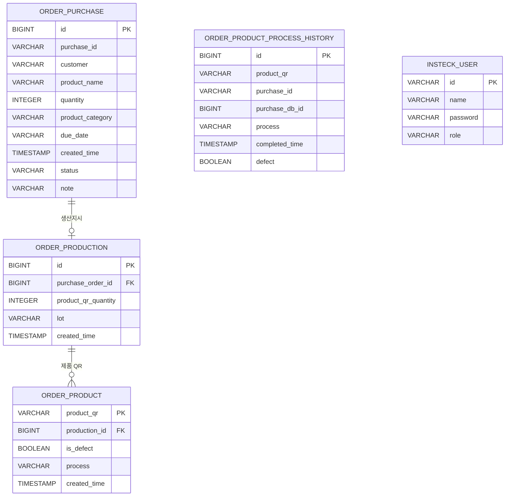

# 데이터베이스 스키마

## 문서 포털

| 분류 | 문서 | 분류 | 문서 |
| --- | --- | --- | --- |
| 루트 README | [README](../readme.md) | 문서 포털 | [Documentation](DOCUMENTATION.md) |
| 설계 문서 | [Engineering](ENGINEERING.md) | 백엔드 | [Backend Docs](../orderSystem/docs/README.md) |

## 목차

> [개요](#개요) · [Entity 관계](#entity-관계) · [테이블과 필드](#테이블과-필드) · [관계로 연결하지 않은 이력](#관계로-연결하지-않은-이력) · [수동 마이그레이션](#수동-마이그레이션) · [핵심 구현 파일](#핵심-구현-파일)

## 개요

이 문서는 현재 JPA Entity와 애너테이션을 기준으로 작성한다. PostgreSQL의 물리 이름은 Hibernate naming strategy에 따라 snake_case로 생성된다.

## Entity 관계

## 테이블과 필드

| Entity | 테이블 | PK | 주요 필드 |
| --- | --- | --- | --- |
| `OrderPurchase` | `order_purchase` | `id` | `purchaseId`, `customer`, `productName`, `quantity`, `productCategory`, `dueDate`, `status`, `note`, `createdTime` |
| `OrderProduction` | `order_production` | `id` | `purchase_order_id`, `productQrQuantity`, `lot`, `createdTime` |
| `OrderProduct` | `order_product` | `productQr` | `production_id`, `isDefect`, `process`, `createdTime` |
| `OrderProductProcessHistory` | `order_product_process_history` | `id` | `productQr`, `purchaseId`, `purchaseDbId`, `process`, `completedTime`, `defect` |
| `InsteckUser` | `insteck_user` | `id` | `name`, `password`, `role` |

## 관계로 연결하지 않은 이력

`OrderProductProcessHistory.productQr`, `purchaseId`, `purchaseDbId`는 값으로 저장하며 JPA 관계가 아니다. 공정 이력을 제품 삭제와 독립적으로 설계했던 수동 마이그레이션이 존재하지만, 현재 Service의 제품·발주 삭제 흐름은 관련 이력도 명시적으로 삭제한다.

## 수동 마이그레이션

| 파일 | 변경 내용 |
| --- | --- |
| `V2` | 발주·생산지시 내부 ID와 FK 관계 분리 |
| `V4` | LOT를 생산지시로 이동하고 제품 중복 컬럼 제거 |
| `V6` | 제품 조회 인덱스 추가 |
| `V7` | 제품 QR 공정 이력 테이블 구성 |
| `V8` | 공정 이력 sequence와 배치 크기 50 정렬 |
| `V9` | `WAITING_FOR_SHIPMENT`을 `SHIPPED`로 변경 |
| `V10` | 발주 가격 컬럼과 `purchase_id` unique 제약 제거 |
| `V11` | 공정 이력에 `purchase_db_id` 추가 |

Flyway는 의존성에 없으므로 SQL은 자동 적용되지 않는다.

## 핵심 구현 파일

- `orderSystem/src/main/java/com/poi/orderSystem/features/entity`
- `orderSystem/src/main/java/com/poi/orderSystem/features/repository`
- `orderSystem/src/main/resources/db/manual`

[문서 맨 위로](#top)

