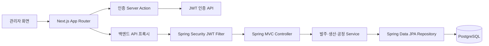

<a id="top"></a>

# 발주·생산·공정 이력 관리 시스템

[](https://openjdk.org/)
[](https://spring.io/projects/spring-boot)
[](https://nextjs.org/)
[](https://react.dev/)
[](https://www.typescriptlang.org/)
[](https://tailwindcss.com/)
[](https://www.postgresql.org/)
[](https://jwt.io/)

## 문서 포털

상세 구현, API, 데이터베이스 구조와 설계 내용은 아래 문서에서 확인한다.

| 분류 | 문서 | 분류 | 문서 |
| --- | --- | --- | --- |
| 루트 README | [README](readme.md) | 문서 포털 | [Documentation](docs/DOCUMENTATION.md) |
| 설계 문서 | [Engineering](docs/ENGINEERING.md) | 데이터베이스 | [Database Schema](docs/database-schema.md) |
| 프론트엔드 | [Frontend Docs](frontend/docs/README.md) | 백엔드 | [Backend Docs](orderSystem/docs/README.md) |
| 프론트 구조 | [Architecture and Pages](frontend/docs/01-architecture-and-pages.md) | 백엔드 구조 | [Architecture and Domain](orderSystem/docs/01-architecture-and-domain.md) |
| 기능과 Drawer | [Features and Drawer](frontend/docs/02-features-and-drawer.md) | API와 흐름 | [API and Flow](orderSystem/docs/02-api-and-flow.md) |
| 프론트 ERD 안내 | [ERD Guide](frontend/docs/erd.md) | 영속성과 성능 | [Persistence and Performance](orderSystem/docs/03-persistence-and-performance.md) |

## 목차

> [프로젝트 개요](#프로젝트-개요) ·
> [주요 구현 내용](#주요-구현-내용) ·
> [업무 흐름](#업무-흐름) ·
> [시스템 아키텍처](#시스템-아키텍처) ·
> [UI 설계](#ui-설계)

> [저장소 구조](#저장소-구조) ·
> [애플리케이션 구성](#애플리케이션-구성) ·
> [실행 방법](#실행-방법) ·
> [데이터베이스 관리](#데이터베이스-관리) ·
> [검증](#검증) ·
> [보안 참고사항](#보안-참고사항) ·
> [현재 구현 범위](#현재-구현-범위)

## 프로젝트 개요

발주 접수부터 생산지시, 제품 QR 생성, 공정 진행, 포장과 출하, 이력 조회까지 관리하는 웹 기반 업무 시스템이다.

프론트엔드는 목록 검색·정렬·행 선택과 오른쪽 상세 Drawer를 제공한다. 백엔드는 발주·생산·제품의 관계와 공정 상태 전환을 관리하고 PostgreSQL에 업무 데이터와 제품별 공정 이력을 저장한다.

제품은 생산지시에 입력한 LOT와 순번을 조합한 `LOT-순번` 형식의 QR로 식별한다. QR 상세 화면에서는 제품 정보, 현재 공정, 불량 여부와 시간순 공정 이력을 함께 조회한다.

## 주요 구현 내용

| 영역 | 구현 내용 |
| --- | --- |
| 발주 관리 | 발주서를 `PURCHASESUBMIT` 상태로 접수하고 조회·수정·삭제 기능을 제공 |
| 생산지시 | 발주와 1:1로 연결된 생산지시에서 LOT와 생산수량을 관리하고 제품 QR을 생성 |
| 제품 공정 | 제품별 공정과 불량 여부를 변경하고 생산지시 단위 일괄 공정 변경을 제공 |
| 공정 이력 | 제품 상태가 변경될 때 QR, 발주 식별자, 공정, 완료 시각과 불량 여부를 저장 |
| 출하 관리 | `PACKAGING` 제품을 발주별로 묶어 조회하고 단건 또는 일괄 출하 처리 |
| 대표 상태 동기화 | 같은 발주의 제품 가운데 가장 느린 공정을 발주의 현재 상태로 반영 |
| QR 조회 | 제품 현재 정보와 시간순 공정 이력을 하나의 응답으로 조회 |
| 발주·출하 이력 | 전체 발주 기록과 `SHIPPED` 상태 제품을 별도 목록으로 제공 |
| 인증과 권한 | BCrypt 비밀번호, JWT Access Token, `USER`·`ADMIN` 역할 기반 접근 제어 |
| 상세 Drawer | 페이지 경로에 따라 발주·생산지시·공정·제품 편집 범위를 전환 |
| 공통 목록 UI | 검색, 다중 정렬, 체크박스 선택, 열 너비 조절과 일괄 작업을 공통 컴포넌트로 제공 |
| 데이터 일관성 | 트랜잭션 안에서 공정 이력과 상태를 변경하고 자식 데이터부터 순서대로 삭제 |

## 업무 흐름

실제 공정 상태(`ProcessStatus`)는 다음 순서로 사용한다.


Enum 값은 `PURCHASESUBMIT`, `INSTRUCTION`, `ASSEMBLY`, `TEST`, `FINAL_INSPECTION`, `PACKAGING`, `SHIPPED`, `CANCEL`이다.

## 시스템 아키텍처



로그인 Server Action은 백엔드에서 발급받은 Access Token을 HttpOnly 쿠키에 저장한다. 브라우저의 업무 API 요청은 Next.js 프록시를 거치며, 프록시는 쿠키의 토큰을 `Authorization: Bearer` 헤더로 백엔드에 전달한다.

백엔드는 Controller, Service, Repository와 Entity 계층으로 구성된다. 조회 Service는 read-only 트랜잭션을 사용하고 생성·상태 변경·출하·삭제는 쓰기 트랜잭션 안에서 처리한다.

## UI 설계

프론트엔드는 업무 카테고리를 이동하는 왼쪽 메뉴, 페이지 제목을 표시하는 헤더, 목록 영역과 오른쪽 상세 Drawer로 구성된다.

- 모바일에서는 메뉴와 본문이 세로 방향으로 배치된다.
- 데스크톱에서는 접을 수 있는 왼쪽 메뉴와 `420px` 오른쪽 Drawer 영역을 사용한다.
- 목록 화면은 공통 검색, 다중 정렬, 행 선택과 열 너비 조절 기능을 사용한다.
- Drawer는 선택한 행과 현재 URL에 따라 발주, 생산지시, 공정 개요와 제품 공정 편집 화면을 전환한다.
- 사이드바 접힘 상태는 `localStorage`에 저장하고 초기 화면부터 적용한다.
- 성공한 변경 요청은 전역 mutation revision을 갱신해 관련 목록을 다시 조회한다.

## 저장소 구조

```text
project/
├─ frontend/                         # Next.js 프론트엔드
│  ├─ app/                           # App Router 페이지와 API 프록시
│  ├─ src/feature/                   # 기능별 화면과 공통 컴포넌트
│  ├─ lib/endpoints.ts               # 백엔드 엔드포인트 정의
│  ├─ util/                          # API 클라이언트와 변경 상태
│  └─ docs/                          # 프론트엔드 문서
├─ orderSystem/                      # Spring Boot 백엔드
│  ├─ src/main/java/                 # Controller, Service, Entity, Repository
│  ├─ src/main/resources/db/manual/  # PostgreSQL 수동 마이그레이션
│  ├─ src/test/java/                 # 단위·통합 테스트
│  └─ docs/                          # 백엔드 문서
├─ docs/                             # 공통 설계와 데이터베이스 문서
│  ├─ DOCUMENTATION.md               # 문서 포털
│  ├─ ENGINEERING.md                 # 시스템 설계
│  └─ database-schema.md             # 실제 JPA 기반 ERD
└─ readme.md                         # 프로젝트 개요
```

## 애플리케이션 구성

| 애플리케이션 | 역할 | 기본 주소 | 문서 |
| --- | --- | --- | --- |
| `frontend` | 화면, 인증 쿠키, API 프록시, Drawer와 목록 상호작용 | `http://localhost:3000` | [Frontend Docs](frontend/docs/README.md) |
| `orderSystem` | 인증, 사용자, 발주, 생산지시, 제품 공정, 출하와 이력 API | `http://localhost:8080` | [Backend Docs](orderSystem/docs/README.md) |
| PostgreSQL | 사용자와 업무 데이터 영속 저장 | `spring.datasource.url` 설정 사용 | [Database Schema](docs/database-schema.md) |

## 실행 방법

### 프론트엔드

```bash
cd frontend
npm install
npm run dev
```

프론트엔드는 기본적으로 `http://localhost:3000`에서 실행된다. 백엔드 주소는 `NEXT_PUBLIC_BACKEND_API_URL`로 설정하며 값이 없으면 `http://localhost:8080`을 사용한다.

### 백엔드

JDK 21이 필요하다.

```bash
cd orderSystem
.\gradlew.bat bootRun
```

백엔드는 기본적으로 `http://localhost:8080`에서 실행된다. `BACKEND_PORT`와 `FRONTEND_ORIGIN` 환경 변수로 포트와 CORS 허용 origin을 변경한다.

### 실행 순서

1. PostgreSQL 접속 정보를 설정한다.
2. 기존 데이터베이스라면 필요한 수동 마이그레이션을 적용한다.
3. `orderSystem`을 실행한다.
4. `frontend`를 실행한다.
5. 회원가입 후 관리자 권한이 필요한 업무 API는 DB 또는 기존 관리자 계정을 통해 `ADMIN` 역할을 사용한다.

## 데이터베이스 관리

JPA는 `spring.jpa.hibernate.ddl-auto=update`를 사용한다. 기존 스키마의 관계·컬럼·인덱스와 sequence 변경은 `orderSystem/src/main/resources/db/manual`의 SQL로 관리한다.

| 마이그레이션 | 역할 |
| --- | --- |
| `V2` | 발주·생산지시 내부 ID와 FK 관계 분리 |
| `V4` | LOT를 생산지시로 이동하고 제품 중복 컬럼 제거 |
| `V6` | 제품 목록과 상태별 조회 인덱스 추가 |
| `V7` | 제품 QR 공정 이력 테이블 구성 |
| `V8` | 공정 이력 sequence와 JPA 배치 크기를 50으로 정렬 |
| `V9` | 이전 출하 대기 상태를 `SHIPPED`로 변경 |
| `V10` | 제거된 가격 컬럼과 발주번호 unique 제약 정리 |
| `V11` | 공정 이력에 발주 DB 식별자 추가 |

Flyway 의존성은 없으므로 SQL 파일은 자동 실행되지 않는다. 기존 PostgreSQL 데이터베이스에 배포할 때 운영자가 필요한 파일을 순서대로 적용한다.

## 검증

### 프론트엔드

```bash
cd frontend
npm.cmd run lint
npm.cmd run build
```

ESLint, TypeScript 검사와 Next.js production build가 통과한다.

### 백엔드

```bash
cd orderSystem
.\gradlew.bat test
```

테스트는 다음 동작을 검증한다.

- 발주·생산지시·제품 삭제 후 연결 데이터 영속 삭제
- 제품 QR 상세와 시간순 공정 이력
- 반복 출하와 중복 QR 일괄 출하
- 발주 상태 필터와 가장 느린 제품 공정 동기화
- 관계 기반 제품 정규화와 대량 제품 저장·조회

## 보안 참고사항

현재 `orderSystem/src/main/resources/application.properties`에 PostgreSQL 접속 정보가 직접 기록돼 있다. 공개 저장소와 운영 환경에서는 다음 조치가 필요하다.

- 데이터베이스 URL, 사용자명과 비밀번호를 환경 변수 또는 secret 저장소로 분리한다.
- `JWT_SECRET`을 충분한 길이의 운영 전용 값으로 설정한다.
- 기본 로컬 JWT secret을 운영 환경에서 사용하지 않는다.
- 관리자 API는 `ADMIN` 역할이 있는 계정만 호출하도록 유지한다.
- 로그와 문서에 Access Token과 접속 정보를 기록하지 않는다.

비밀번호는 BCrypt로 저장하며 서버는 stateless JWT 인증을 사용한다. 로그아웃은 클라이언트 HttpOnly 쿠키를 삭제하지만 서버 측 토큰 폐기 목록은 관리하지 않는다.

## 현재 구현 범위

다음 기술은 현재 프로젝트 소스에 구현돼 있지 않다.

- Redis 저장과 캐시
- Spring Batch Job
- Scheduler와 `@Scheduled` 작업
- WebSocket endpoint, handler와 broker 설정
- Dockerfile과 Docker Compose

`spring-boot-starter-websocket` 의존성은 존재하지만 WebSocket 동작을 구성하는 코드는 없다.

<div align="right">

[문서 맨 위로](#top)

</div>
