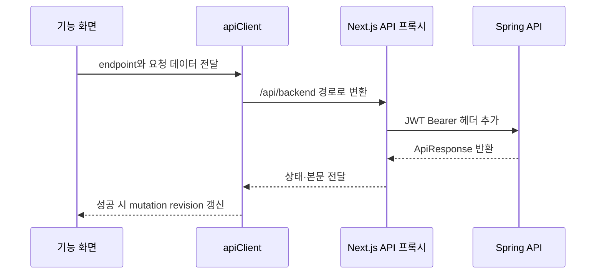

<a id="top"></a>

# 프론트엔드 구조와 페이지

## 문서 포털

| 분류 | 문서 | 분류 | 문서 |
| --- | --- | --- | --- |
| 프론트 문서 | [README](README.md) | 기능·Drawer | [기능과 Drawer](02-features-and-drawer.md) |
| 전체 문서 | [Documentation](../../docs/DOCUMENTATION.md) | 데이터베이스 | [Database Schema](../../docs/database-schema.md) |

## 목차

> [프로젝트 구조](#프로젝트-구조) · [페이지 구조](#페이지-구조) · [컴포넌트 구조](#컴포넌트-구조) · [상태 관리](#상태-관리) · [API 호출 구조](#api-호출-구조) · [UI 설계](#ui-설계) · [성능 최적화](#성능-최적화) · [핵심 구현 파일](#핵심-구현-파일)

## 프로젝트 구조

```text
frontend/
├─ app/                    # 라우팅 진입점과 API 프록시
├─ src/feature/            # 기능별 화면과 공통 UI
├─ lib/endpoints.ts        # 백엔드 URL 정의
├─ util/apiClient.ts       # 요청·오류·중복 변경 처리
└─ util/apiMutationStore.ts# 변경 후 목록 재조회 revision
```

## 페이지 구조

| URL | 화면 | 실제 동작 |
| --- | --- | --- |
| `/` | 진입점 | `/dashboard`로 redirect |
| `/dashboard` | 전체현황 | 공개 대시보드 API의 최근 발주 최대 30건과 공정 진행 표시 |
| `/orders` | 발주서 접수 | `PURCHASESUBMIT` 발주 조회·생성·수정·삭제 |
| `/production-orders` | 생산지시 | 생산수량·LOT·QR 생성 정보 조회·수정·삭제 |
| `/product-processes` | 공정현황 | 생산지시 단위 공정 조회 |
| `/process-histories` | 공정현황(세부) | 제품 QR 단위 공정·불량 변경과 일괄 변경 |
| `/shipments` | 납품/출하 | 포장 제품 묶음 조회와 단건·일괄 출하 |
| `/labels` | 라벨출력 | 제품 QR·LOT·제품 정보 목록 표시 |
| `/qr-search` | QR조회 | QR 상세와 공정 이력 조회 |
| `/scan` | 스캔 | `QrSearchPage`를 “QR 스캔 결과” 제목으로 재사용 |
| `/order-purchase-histories` | 발주이력 | 전체 현재 발주 이력 조회와 선택 삭제 |
| `/histories` | 출하이력 | `SHIPPED` 제품 조회 전용 화면 |
| `/settings/users` | 내 정보 | 이름·비밀번호 변경 |
| `/settings/permissions` | 권한 설정 | 사용자 역할 일괄 변경과 삭제 |
| `/production` | 준비 화면 | `PlaceholderPage`로 생산관리 준비 상태 표시 |

## 컴포넌트 구조

`app/**/page.tsx`는 `src/feature`의 페이지 컴포넌트만 렌더링한다. `MainLayout`은 로그인·회원가입을 제외한 화면에 좌측 메뉴와 헤더를 적용한다. `(order)` 레이아웃은 `OrderSidebarProvider`를 적용해 목록과 오른쪽 Drawer를 함께 배치한다.

공통 목록은 `DataListTable`, `ListToolbar`, `ListCheckbox`, `ResizableTableColumns`를 조합해 검색, 다중 정렬, 선택, 열 조절을 제공한다.

## 상태 관리

| 상태 | 구현 | 범위 |
| --- | --- | --- |
| 인증 사용자 | `AuthContext` | 전체 앱 |
| 선택 행·Drawer | `OrderSidebarContext` | `(order)` 페이지 |
| API 변경 revision | `useSyncExternalStore` | 변경 후 관련 목록 재조회 |
| 검색·정렬·선택 | `useState`, `useMemo` | 각 목록 화면 |
| 사이드바 접힘 | `localStorage` | 브라우저 재방문 유지 |

## API 호출 구조



동일한 HTTP 메서드와 URL의 변경 요청이 진행 중이면 `apiClient`가 두 번째 요청을 차단한다.

## UI 설계

- 모바일에서는 좌측 메뉴가 상단 방향으로 배치되고 데스크톱에서는 고정 폭 사이드바가 된다.
- 데스크톱 업무 화면은 오른쪽 Drawer 공간 `420px`을 미리 확보한다.
- 카테고리별 accent 색상을 메뉴, 목록, 공정 진행 표시에서 재사용한다.
- Drawer가 비활성인 페이지도 고정 패널 영역을 유지해 레이아웃 폭을 동일하게 사용한다.

## 성능 최적화

- 정렬·검색 결과는 `useMemo`로 계산한다.
- 선택 여부는 공통 테이블에서 `Set`으로 변환한다.
- 열 크기 변경은 pointer 이동 동안 필요한 너비만 갱신한다.
- QR·대시보드 조회는 `AbortSignal`을 사용해 이전 요청을 취소한다.
- API 변경 revision으로 관련 화면만 재조회한다.

## 핵심 구현 파일

- `app/layout.tsx`
- `app/api/backend/[...path]/route.ts`
- `src/feature/layout/MainLayout.tsx`
- `src/feature/layout/LayoutSidebar.tsx`
- `src/feature/common/DataListTable.tsx`
- `util/apiClient.ts`
- `util/apiMutationStore.ts`

<div align="right">

[문서 맨 위로](#top)

</div>
