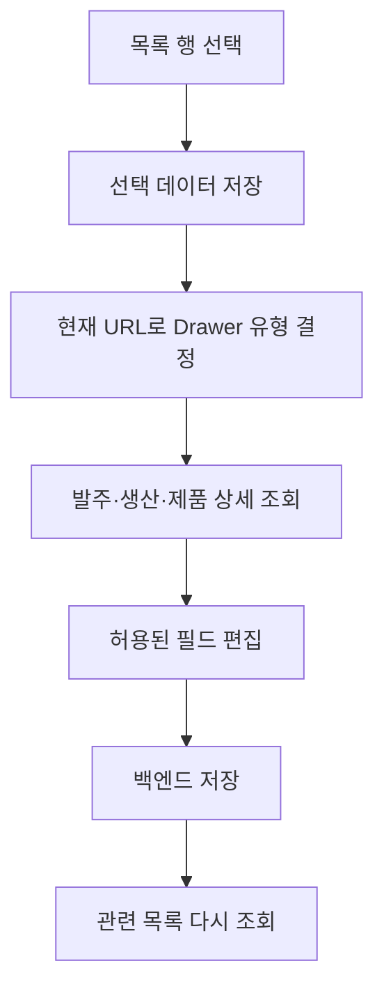

# 프론트엔드 기능과 Drawer

## 문서 포털

| 분류 | 문서 | 분류 | 문서 |
| --- | --- | --- | --- |
| 프론트 문서 | [README](README.md) | 구조·페이지 | [구조와 페이지](01-architecture-and-pages.md) |
| 백엔드 API | [Backend API](../../orderSystem/docs/02-api-and-flow.md) | 데이터베이스 | [Database Schema](../../docs/database-schema.md) |

## 목차

> [주요 기능](#주요-기능) · [Drawer 구조](#drawer-구조) · [카테고리별 편집 범위](#카테고리별-편집-범위) · [업무 데이터 흐름](#업무-데이터-흐름) · [API 연결](#api-연결) · [핵심 구현 파일](#핵심-구현-파일)

## 주요 기능

- 발주서 생성과 발주 접수 목록을 관리한다.
- 생산지시에서 발주를 선택하고 LOT와 제품 수량을 입력한다.
- 생산지시 단위와 제품 QR 단위로 공정을 변경한다.
- 불량 여부를 제품 단위 또는 선택 행 일괄로 저장한다.
- 포장 완료 제품을 발주 단위로 묶어 출하한다.
- QR 검색 결과에 현재 공정과 시간순 공정 이력을 표시한다.
- 사용자 이름·비밀번호와 관리자 역할을 관리한다.

## Drawer 구조

`OrderSidebarProvider`는 선택된 목록 행과 발주 선택지를 보관한다. `OrderRightPanel`은 현재 URL을 `DrawerCategory`로 변환하고 `OrderUnifiedDetailDrawer`에 전달한다.

선택 대상이 바뀌면 이전 발주·생산·제품 상세 상태를 먼저 비우고 새 요청을 시작한다. 페이지 이동 시 선택도 초기화한다.

## 카테고리별 편집 범위

| DrawerCategory | 경로 | 편집 범위 |
| --- | --- | --- |
| `PURCHASE` | `/orders` 및 기본 업무 화면 | 발주 정보 |
| `PRODUCTION` | `/production-orders` | 발주 선택, LOT, 생산수량 |
| `PROCESS_OVERVIEW` | `/product-processes` | 생산지시 전체 제품 공정 |
| `PRODUCT` | `/process-histories` | 개별 제품 공정과 불량 여부 |
| `DISABLED` | 라벨·QR·이력·출하·설정·스캔 | 상세 편집 비활성 |

## 업무 데이터 흐름

## API 연결

| 기능 | 메서드와 URL |
| --- | --- |
| 발주 목록 | `GET /order` |
| 발주 생성 | `POST /order/post` |
| 발주 상세 변경 | `PUT /order/{id}` |
| 생산지시 | `GET·POST /order/productions`, `PUT /order/productions/{id}` |
| 제품 공정 | `PUT /order/product-processes/{productQr}` |
| 생산 단위 공정 | `PUT /order/product-processes/by-production/{purchaseDbId}` |
| 출하 목록 | `GET /order/shipments` |
| 일괄 출하 | `PUT /order/shipments/complete` |
| QR 상세 | `GET /order/products/qr/{productQr}` |
| 사용자 설정 | `GET /users/me`, `PUT /users/me/name`, `PUT /users/me/password` |

## 핵심 구현 파일

- `src/feature/ordersidebar/OrderSidebarContext.tsx`
- `src/feature/ordersidebar/OrderRightPanel.tsx`
- `src/feature/ordersidebar/OrderUnifiedDetailDrawer.tsx`
- `src/feature/ordersidebar/orderDetailApi.ts`
- `src/feature/order/OrdersListPage.tsx`
- `src/feature/production-order/ProductionOrdersPage.tsx`
- `src/feature/process-history/ProcessHistoriesPage.tsx`

[문서 맨 위로](#top)

