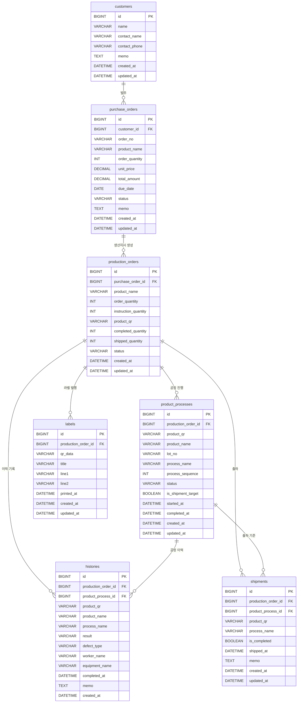

# 발주/생산/공정/출하 ERD

## 개요

이 문서는 발주서 등록부터 생산지시, 제품 QR 생성, 공정 진행, 납품출하, 라벨 발행, 이력 조회까지의 데이터를 관리하기 위한 ERD 초안이다.

업무 흐름은 다음과 같다.

1. 클라이언트가 발주서를 전송한다.
2. 관리자는 컴퓨터에 발주서를 등록한다.
3. 생산자는 발주서를 기준으로 생산지시를 만든다.
4. 생산지시를 기준으로 제품 QR이 생성된다.
5. 제품 QR은 공정 진행, 출하, 이력 조회에 사용된다.

## 핵심 테이블

| 테이블 | 역할 |
| --- | --- |
| `customers` | 발주 고객사를 관리한다. |
| `purchase_orders` | 고객사가 요청한 발주 정보를 관리한다. |
| `production_orders` | 발주서를 기준으로 생산지시와 제품 QR을 관리한다. |
| `product_processes` | 제품 QR별 공정 진행 상태를 관리한다. |
| `shipments` | 제품 QR 기준 납품출하 상태를 관리한다. |
| `labels` | 제품 QR 라벨 출력 데이터를 관리한다. |
| `histories` | 제품 QR 기준 공정, 판정, 작업 이력을 관리한다. |

## 테이블 설계

### `customers`

고객사는 발주서를 전송하는 주체이며, 하나의 고객사는 여러 발주서를 가질 수 있다.

| 컬럼명 | 타입 | PK/FK | Null | 설명 |
| --- | --- | --- | --- | --- |
| `id` | `BIGINT` | PK | N | 고객사 식별자 |
| `name` | `VARCHAR(100)` |  | N | 고객사명 |
| `contact_name` | `VARCHAR(50)` |  | Y | 담당자명 |
| `contact_phone` | `VARCHAR(30)` |  | Y | 담당자 연락처 |
| `memo` | `TEXT` |  | Y | 고객사 비고 |
| `created_at` | `DATETIME` |  | N | 등록 일시 |
| `updated_at` | `DATETIME` |  | N | 수정 일시 |

### `purchase_orders`

발주서는 고객사가 요청한 품목, 수량, 단가, 금액, 납기 정보를 관리한다.

| 컬럼명 | 타입 | PK/FK | Null | 설명 |
| --- | --- | --- | --- | --- |
| `id` | `BIGINT` | PK | N | 발주서 식별자 |
| `customer_id` | `BIGINT` | FK | N | 고객사 식별자 |
| `order_no` | `VARCHAR(50)` |  | N | 발주번호 |
| `product_name` | `VARCHAR(200)` |  | N | 품명 |
| `order_quantity` | `INT` |  | N | 발주수량 |
| `unit_price` | `DECIMAL(15,2)` |  | Y | 단가 |
| `total_amount` | `DECIMAL(15,2)` |  | Y | 총 금액 |
| `due_date` | `DATE` |  | Y | 납기 |
| `status` | `VARCHAR(30)` |  | N | 발주 상태 |
| `memo` | `TEXT` |  | Y | 발주 비고 |
| `created_at` | `DATETIME` |  | N | 등록 일시 |
| `updated_at` | `DATETIME` |  | N | 수정 일시 |

### `production_orders`

생산지시는 발주서를 기준으로 생산해야 할 수량과 제품 QR 생성 기준을 관리한다.

| 컬럼명 | 타입 | PK/FK | Null | 설명 |
| --- | --- | --- | --- | --- |
| `id` | `BIGINT` | PK | N | 생산지시 식별자 |
| `purchase_order_id` | `BIGINT` | FK | N | 발주서 식별자 |
| `product_name` | `VARCHAR(200)` |  | N | 품명 |
| `order_quantity` | `INT` |  | N | 발주수량 |
| `instruction_quantity` | `INT` |  | N | 지시수량 |
| `product_qr` | `VARCHAR(100)` |  | N | 제품 QR 데이터 |
| `completed_quantity` | `INT` |  | N | 완료수량 |
| `shipped_quantity` | `INT` |  | N | 출하수량 |
| `status` | `VARCHAR(30)` |  | N | 생산지시 상태 |
| `created_at` | `DATETIME` |  | N | 등록 일시 |
| `updated_at` | `DATETIME` |  | N | 수정 일시 |

### `product_processes`

제품공정은 제품 QR이 어떤 공정을 진행 중인지, 완료되었는지, 출하 대상인지 관리한다.

| 컬럼명 | 타입 | PK/FK | Null | 설명 |
| --- | --- | --- | --- | --- |
| `id` | `BIGINT` | PK | N | 제품공정 식별자 |
| `production_order_id` | `BIGINT` | FK | N | 생산지시 식별자 |
| `product_qr` | `VARCHAR(100)` |  | N | 제품 QR 데이터 |
| `product_name` | `VARCHAR(200)` |  | N | 품명 |
| `lot_no` | `VARCHAR(100)` |  | Y | LOT 번호 |
| `process_name` | `VARCHAR(100)` |  | N | 공정명 |
| `process_sequence` | `INT` |  | Y | 공정 순서 |
| `status` | `VARCHAR(30)` |  | N | 공정 상태 |
| `is_shipment_target` | `BOOLEAN` |  | N | 출하 대상 여부 |
| `started_at` | `DATETIME` |  | Y | 공정 시작 일시 |
| `completed_at` | `DATETIME` |  | Y | 공정 완료 일시 |
| `created_at` | `DATETIME` |  | N | 등록 일시 |
| `updated_at` | `DATETIME` |  | N | 수정 일시 |

### `shipments`

납품출하는 제품 QR과 생산지시를 기준으로 실제 출하 완료 여부를 관리한다.

| 컬럼명 | 타입 | PK/FK | Null | 설명 |
| --- | --- | --- | --- | --- |
| `id` | `BIGINT` | PK | N | 납품출하 식별자 |
| `production_order_id` | `BIGINT` | FK | N | 생산지시 식별자 |
| `product_process_id` | `BIGINT` | FK | Y | 출하 기준 제품공정 식별자 |
| `product_qr` | `VARCHAR(100)` |  | N | 제품 QR 데이터 |
| `process_name` | `VARCHAR(100)` |  | Y | 출하 전 마지막 공정명 |
| `is_completed` | `BOOLEAN` |  | N | 출하 완료 여부 |
| `shipped_at` | `DATETIME` |  | Y | 출하 일시 |
| `memo` | `TEXT` |  | Y | 출하 비고 |
| `created_at` | `DATETIME` |  | N | 등록 일시 |
| `updated_at` | `DATETIME` |  | N | 수정 일시 |

### `labels`

라벨은 제품 QR을 출력하거나 화면에 표시하기 위한 라벨 데이터를 관리한다.

| 컬럼명 | 타입 | PK/FK | Null | 설명 |
| --- | --- | --- | --- | --- |
| `id` | `BIGINT` | PK | N | 라벨 식별자 |
| `production_order_id` | `BIGINT` | FK | N | 생산지시 식별자 |
| `qr_data` | `VARCHAR(100)` |  | N | 라벨에 출력할 QR 데이터 |
| `title` | `VARCHAR(100)` |  | Y | 라벨 제목 |
| `line1` | `VARCHAR(200)` |  | Y | 라벨 첫 번째 표시 문구 |
| `line2` | `VARCHAR(200)` |  | Y | 라벨 두 번째 표시 문구 |
| `printed_at` | `DATETIME` |  | Y | 라벨 출력 일시 |
| `created_at` | `DATETIME` |  | N | 등록 일시 |
| `updated_at` | `DATETIME` |  | N | 수정 일시 |

### `histories`

이력은 제품 QR을 기준으로 공정 완료 시간, 판정, 불량유형, 작업자, 설비 정보를 기록한다.

| 컬럼명 | 타입 | PK/FK | Null | 설명 |
| --- | --- | --- | --- | --- |
| `id` | `BIGINT` | PK | N | 이력 식별자 |
| `production_order_id` | `BIGINT` | FK | N | 생산지시 식별자 |
| `product_process_id` | `BIGINT` | FK | Y | 제품공정 식별자 |
| `product_qr` | `VARCHAR(100)` |  | N | 제품 QR 데이터 |
| `product_name` | `VARCHAR(200)` |  | N | 품명 |
| `process_name` | `VARCHAR(100)` |  | N | 공정명 |
| `result` | `VARCHAR(30)` |  | N | 판정 |
| `defect_type` | `VARCHAR(100)` |  | Y | 불량유형 |
| `worker_name` | `VARCHAR(50)` |  | Y | 작업자 |
| `equipment_name` | `VARCHAR(100)` |  | Y | 설비 |
| `completed_at` | `DATETIME` |  | Y | 완료시간 |
| `memo` | `TEXT` |  | Y | 이력 비고 |
| `created_at` | `DATETIME` |  | N | 등록 일시 |

## 관계

- `customers` 1 : N `purchase_orders`
- `purchase_orders` 1 : N `production_orders`
- `production_orders` 1 : N `product_processes`
- `production_orders` 1 : N `shipments`
- `production_orders` 1 : N `labels`
- `production_orders` 1 : N `histories`
- `product_processes` 1 : N `histories`
- `product_processes` 1 : N `shipments`

## Mermaid ERD

## QR 조회 기준

QR조회는 `product_qr` 또는 `qr_data`를 입력받아 제품 상태와 이력을 조회한다.

조회 기준은 다음과 같다.

- 현재 생산지시 상태는 `production_orders.product_qr`로 조회한다.
- 현재 공정 상태는 `product_processes.product_qr`로 조회한다.
- 출하 상태는 `shipments.product_qr`로 조회한다.
- 작업 이력은 `histories.product_qr`로 조회한다.
- 라벨 출력 데이터는 `labels.qr_data`로 조회한다.

## 추가 확인 필요

- 제품 QR이 생산지시 1건당 1개인지, 생산 수량만큼 여러 개 생성되는지 확인이 필요하다.
- 발주서 1건에 품목이 1개만 들어가는지, 여러 품목이 들어갈 수 있는지 확인이 필요하다.
- `product_qr`을 각 테이블에 중복 저장할지, 별도 제품 테이블을 만들어 참조할지 확인이 필요하다.
- 공정 마스터 테이블이 필요한지 확인이 필요하다.
- 작업자와 설비를 문자열로 저장할지, 별도 기준정보 테이블로 분리할지 확인이 필요하다.
- 라벨이 생산지시 단위인지, 제품 QR 단위인지 확인이 필요하다.
- 출하가 제품 QR 단위인지, 생산지시 단위 묶음 출하인지 확인이 필요하다.
- 상태값(`status`, `result`)의 허용 값 목록 정의가 필요하다.
- 단가와 총 금액을 발주서에 직접 저장할지, 품목 상세 테이블로 분리할지 확인이 필요하다.
