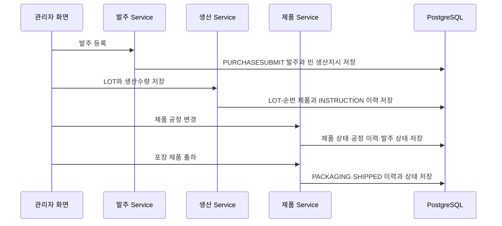

# 백엔드 API와 업무 흐름

## 문서 포털

| 분류 | 문서 | 분류 | 문서 |
| --- | --- | --- | --- |
| 백엔드 문서 | [README](README.md) | 구조·도메인 | [구조와 도메인](01-architecture-and-domain.md) |
| 프론트 기능 | [Frontend Features](../../frontend/docs/02-features-and-drawer.md) | 데이터베이스 | [Database Schema](../../docs/database-schema.md) |

## 목차

> [인증 API](#인증-api) · [사용자 API](#사용자-api) · [발주 API](#발주-api) · [생산지시 API](#생산지시-api) · [제품·출하 API](#제품출하-api) · [이력 API](#이력-api) · [업무 흐름](#업무-흐름) · [삭제 흐름](#삭제-흐름) · [핵심 구현 파일](#핵심-구현-파일)

## 인증 API

| 메서드 | URL | 인증 | 동작 |
| --- | --- | --- | --- |
| `POST` | `/auth/register` | 없음 | `USER` 역할로 회원가입 |
| `POST` | `/auth/login` | 없음 | Access Token과 사용자 정보 반환 |
| `POST` | `/auth/logout` | 필요 | 성공 응답 반환, 토큰 무효화 저장소는 없음 |

## 사용자 API

| 메서드 | URL | 동작 |
| --- | --- | --- |
| `GET` | `/users/me` | 인증 사용자 조회 |
| `PUT` | `/users/me/password` | BCrypt 비밀번호 변경 |
| `PUT` | `/users/me/name` | 이름 변경 |
| `GET` | `/users` | 사용자 목록 |
| `PUT` | `/users/roles` | 역할 일괄 변경 |
| `DELETE` | `/users` | ID 목록 사용자 삭제 |

## 발주 API

| 메서드 | URL | 동작 |
| --- | --- | --- |
| `GET` | `/order` | `PURCHASESUBMIT` 발주 목록 |
| `GET` | `/order/getDashBoard` | `SHIPPED`, `CANCEL` 제외 최근 30건 |
| `GET` | `/order/{id}` | 발주 상세 |
| `POST` | `/order/post` | 발주와 초기 생산지시 생성 |
| `PUT` | `/order/{id}` | 발주 수정 |
| `DELETE` | `/order/{id}` | 연결 데이터와 발주 삭제 |
| `GET` | `/order/purchase-histories` | `SHIPPED` 발주 이력 |
| `GET` | `/order-purchase-history` | 모든 현재 발주 이력 |

## 생산지시 API

| 메서드 | URL | 동작 |
| --- | --- | --- |
| `GET` | `/order/productions` | `SHIPPED`, `CANCEL` 제외 생산지시 |
| `GET` | `/order/productions/product-processes` | 접수·출하·취소 제외 공정현황 |
| `POST` | `/order/productions` | 생산수량과 LOT 저장·QR 생성 |
| `PUT` | `/order/productions/{id}` | 생산지시 수정·추가 QR 생성 |
| `DELETE` | `/order/productions/{id}` | 연결 데이터와 발주까지 삭제 |

## 제품·출하 API

| 메서드 | URL | 동작 |
| --- | --- | --- |
| `GET` | `/order/process-histories` | 접수·출하·취소 제외 제품 목록 |
| `PUT` | `/order/product-processes/{productQr}` | 제품 공정·불량 변경 |
| `PUT` | `/order/product-processes/by-production/{purchaseDbId}` | 생산지시 제품 공정 일괄 변경 |
| `DELETE` | `/order/product-processes/{productQr}` | 제품과 해당 공정 이력 삭제 |
| `GET` | `/order/shipments` | `PACKAGING` 제품을 발주별 묶음 조회 |
| `PUT` | `/order/shipments/{productQr}/complete` | 단일 제품 출하 |
| `PUT` | `/order/shipments/complete` | QR 목록 일괄 출하 |
| `GET` | `/order/labels` | 제품 라벨 데이터 조회 |
| `GET` | `/order/products/qr/{productQr}` | QR 현재 상태와 공정 이력 |

## 이력 API

`GET /order/histories`와 `GET /order/histories/{productQr}`는 발주 상태가 `SHIPPED`인 제품을 조회한다. POST·PUT·DELETE 엔드포인트도 선언돼 있지만 Service가 “별도로 생성·수정·삭제할 수 없다”는 `400` 오류를 반환한다.

## 업무 흐름

## 삭제 흐름

## 핵심 구현 파일

- `features/Order/*/*Controller.java`
- `features/Order/*/*Service.java`
- `features/auth/controller/AuthController.java`
- `features/user/UserController.java`

[문서 맨 위로](#top)

